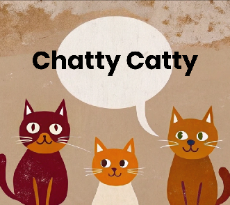

#  Chatty Catty Chat App

## Project Description:
To build a chat app for mobile devices using React Native. The app will
provide users with a chat interface and options to share images and their
location.

## Key Features:
● A page where users can enter their name, choose a background color and avatar image for the chat screen
before joining the chat. 
● A page displaying the conversation, as well as an input field and submit button. 
● The chat must provide users with two additional communication features: sending images
and location data. 
● Data gets stored online and offline.

## User Stories:
● As a new user, I want to be able to easily enter a chat room so I can quickly start talking to my
friends and family. 
● As a user, I want to be able to send messages to my friends and family members to exchange
the latest news. 
● As a user, I want to send images to my friends to show them what I’m currently doing. 
● As a user, I want to share my location with my friends to show them where I am. 
● As a user, I want to be able to read my messages offline so I can reread conversations at any
time. 
● As a user with a visual impairment, I want to use a chat app that is compatible with a screen
reader so that I can engage with a chat interface.

## Usage
### Start Screen
Users will initially with the Start screen where they have options to choose their chat name, background color of the chat window and an avatar to be used along with their messages. 

  

### Chat Screen
After the user clicks the 'Start Chatting' button, they will be navigated to the Chat screen. Their anonymous authentication has occurred and the chat will then pull older messages from the chat from the Firestore Database, and any images from the Firebase Storage.  These will render in the chat window upon loading.

  

Tapping the input field will allow the user to type on the keybaord to enter a message, once a message has been entered they can tap 'Send' to send their message.

  

The circle with the plus sign + in it is the button for other message options.  This will present a menu for choosing a photo from the device's library, taking a photo using the device's camera, sending the user's current location or cancelling the menu.  All non-cancel options will get appropriate permissions from the user prior to the app accessing the features on their device.  Maps and images are interactive and can be tapped.  Tapping images will show the image in full size and tapping maps will open the location in the Google Maps app or on the web browser. 

  

### Offline Status
Should the user lose their network connection, *Chatty Catty* will be usable with some limitations.  The user will be notified by an alert that their network connection has been lost. 

  

After that, the input field will be disabled and not visible on the screen.  The messages from the chat will all be pulled from cache using AsyncStorage to allow the user to still read messages even when offline. When the network connection has been restored, *Chatty Catty* will reconenct to the database/storage and sync the chat with any messages that were missed while offline.

  

## How to install *Chatty Catty*

## Technologies Used
- React Native
- Expo / Expo Go (SDK 53)
- AsyncStorage
- Google Maps, Firebase & Firestore Platforms
- RecraftAI (all *Chatty Catty* images created using RecraftAI)
- (See package.json for specific versions)
  
### Dependencies
- Google Firebase Storage (image storage)
- Google Firestore Database (message storage)
- Google Firestore Authentication (OAuth)
- Google Maps Platform (static map generation)
